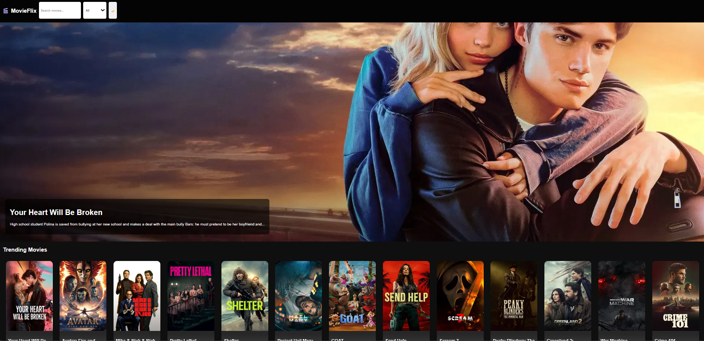

# 🎬 Movie Recommendation System

<p align="center">
  <a href="https://AyanPrt43.github.io/movie-recommendation-system/" target="_blank">
    
  </a>
</p>

---

## 📸 Preview



---

## 📌 About the Project

This is a **Movie Recommendation Website** that helps users discover movies based on their interests.  
It features a clean UI, responsive design, and interactive functionality.

---

## ✨ Features

- 🎥 Movie recommendations  
- 🔍 Search functionality  
- 🎨 Attractive UI/UX design  
- 📱 Fully responsive website  
- ⚡ Fast and lightweight  

---

## 🛠️ Tech Stack

- HTML  
- CSS  
- JavaScript  

---

## 🚀 How to Run Locally

1. Clone the repository:
   ```bash
   git clone https://github.com/AyanPrt43/movie-recommendation-system.git
